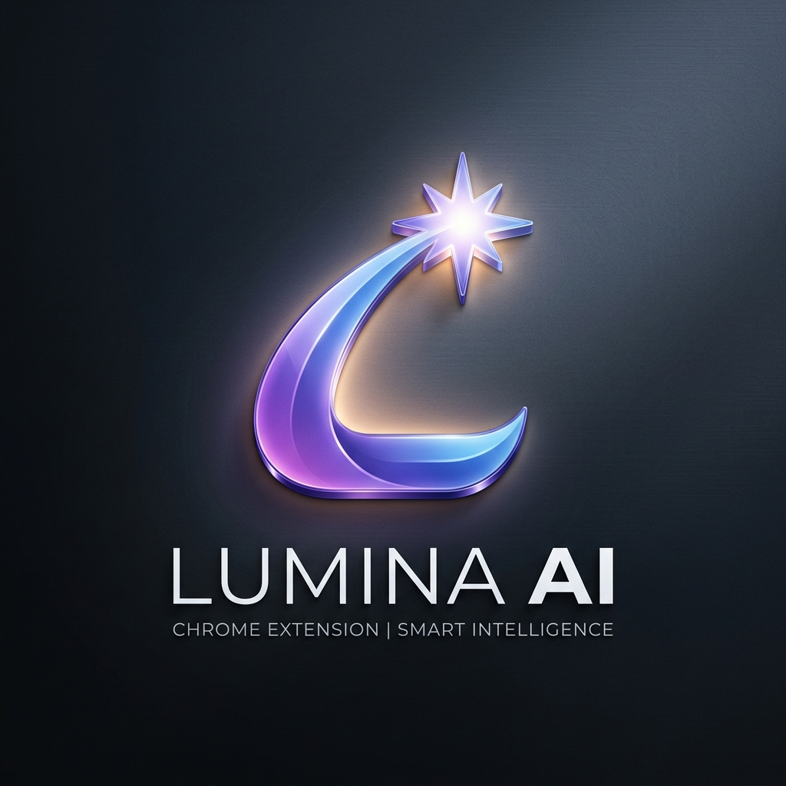
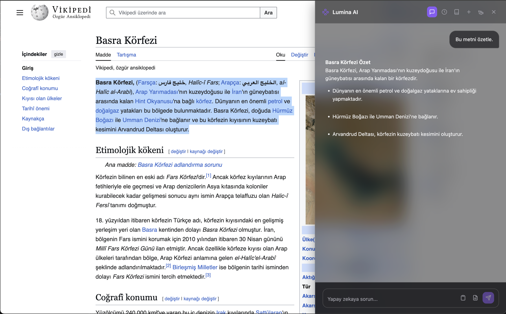

  

# Lumina AI Web Assistant 🚀

[Turkish](#turkish) | [English](#english)

---

## 🇹🇷 Türkçe (Turkish)

### 📝 Açıklama
**Lumina AI Web Assistant**, web deneyiminizi yapay zeka ile güçlendiren, ultra hızlı ve premium tasarımlı bir Chrome eklentisidir. Sayfaları saniyeler içinde özetler, karmaşık metinleri açıklar ve önemli bilgileri not almanızı sağlar.

### ✨ Öne Çıkan Özellikler

- **🌐 Çoklu Sağlayıcı Desteği:** 
  - **Groq (LPU):** Dünyanın en hızlı yapay zeka çıkarım motoru.
  - **OpenAI:** GPT-4o ve o3-mini modelleri.
  - **Google Gemini:** Gemini 2.0 Flash ve Pro desteği.
  - **Anthropic:** Claude 3.5 Sonnet ve Opus modelleri.
  - **xAI Grok:** Grok-2 modelleri.
- **📝 Notlarım Sistemi:** Yapay zeka yanıtlarını tek tıkla kaydedin veya manuel notlar oluşturun.
- **🕒 Sohbet Geçmişi:** Geçmiş tüm konuşmalarınıza istediğiniz zaman geri dönün, silin veya yönetin.
- **⚡ Akıllı Giriş Alanı:** 
  - **Panodan Yapıştır:** Kopyaladığınız metni tek tıkla yapıştırın.
  - **Hızlı Özetle:** Mevcut sayfayı anında analiz edin.
- **🖱️ Seçim Araç Kutusu:** Herhangi bir metni seçtiğinizde beliren mini menü ile anında "Özetle" veya "Açıkla".
- **🎨 Premium Tasarım:** Modern "Zinc" renk paleti, glassmorphism efektleri ve akıcı animasyonlar.

### 🛠️ Kurulum

1. Bu depoyu indirin veya clone'layın.
2. Chrome'da `chrome://extensions` adresine gidin.
3. Sağ üstteki "Geliştirici Modu"nu açın.
4. "Paketlenmemiş öğe yükle" butonuna tıklayın ve bu klasörü seçin.
5. Eklenti simgesine tıklayarak Ayarlar'dan API anahtarınızı girin.

### 🔒 Güvenlik ve Gizlilik

- API anahtarlarınız asla uzak sunuculara gönderilmez.
- Tüm veriler yerel tarayıcı depolamanızda (`chrome.storage.local`) saklanır.
- Kod tamamen şeffaftır ve kişisel verilerinizi toplamaz.

---

## 🇺🇸 English

### 📝 Description
**Lumina AI Web Assistant** is an ultra-fast, premium-designed Chrome extension that enhances your web experience with AI. It summarizes pages in seconds, explains complex texts, and allows you to take important notes instantly.

### ✨ Key Features

- **🌐 Multi-Provider Support:** 
  - **Groq (LPU):** The world's fastest AI inference engine.
  - **OpenAI:** GPT-4o and o3-mini models.
  - **Google Gemini:** Gemini 2.0 Flash and Pro support.
  - **Anthropic:** Claude 3.5 Sonnet and Opus models.
  - **xAI Grok:** Grok-2 support.
- **📝 Notes System:** Save AI responses with one click or create manual notes.
- **🕒 Chat History:** Revisit, delete, or manage all your past conversations anytime.
- **⚡ Smart Input Area:** 
  - **Paste from Clipboard:** Paste copied text with a single click.
  - **Quick Summarize:** Analyze the current page instantly.
- **🖱️ Selection Toolbox:** Instant "Summarize" or "Explain" mini-menu upon text selection.
- **🎨 Premium Design:** Modern "Zinc" color palette, glassmorphism effects, and smooth animations.

### 🛠️ Installation

1. Download or clone this repository.
2. Go to `chrome://extensions` in your Chrome browser.
3. Enable "Developer Mode" in the top right corner.
4. Click "Load unpacked" and select this folder.
5. Click the extension icon and enter your API key in Settings.

### 🔒 Security and Privacy

- Your API keys are never sent to remote servers.
- All data is stored locally in your browser storage (`chrome.storage.local`).
- The code is fully transparent and does not collect personal data.

---

*Lumina AI ile interneti daha hızlı keşfedin / Explore the internet faster with Lumina AI.*
